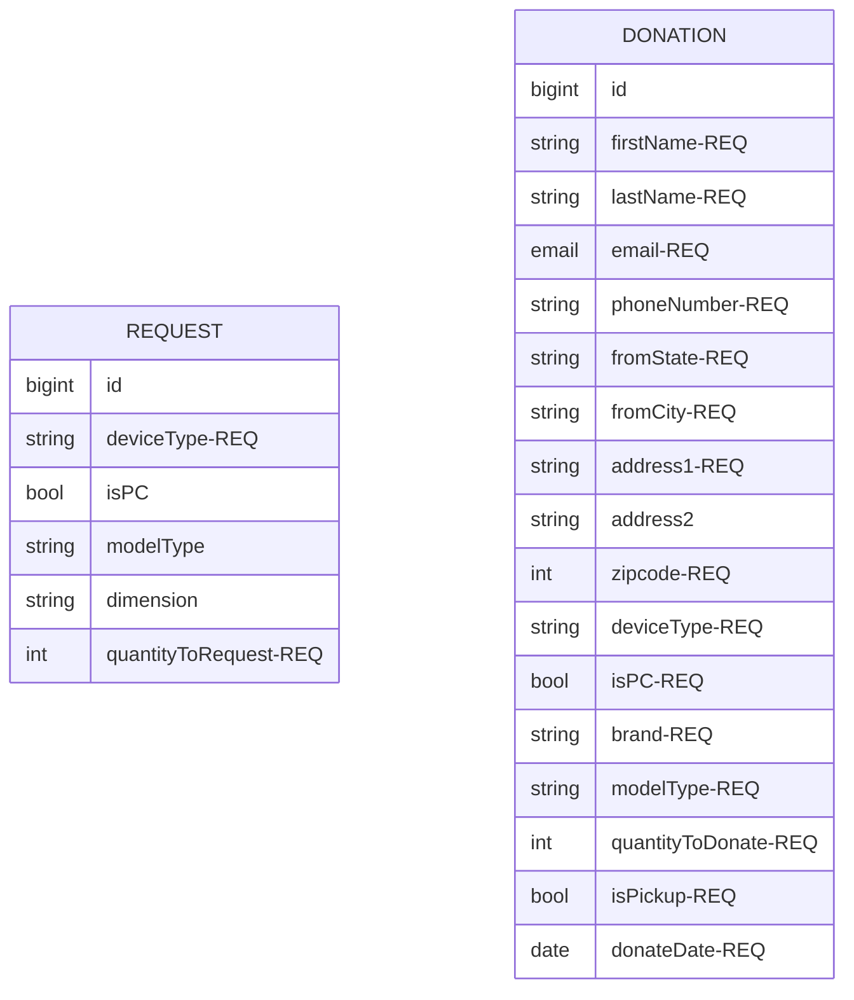

# Give2Learn Backend
This is the API/backend for [Give2Learn](https://github.com/Mortez-usa/give2learn-frontend), a full CRUD app designed to provide refurbished laptops to schoolchildren in need. Built on a Express/Node backend (with a MongoDB) and Next.js frontend.

#### Technologies Used
##### Backend
- Javascript
- Express
- Node
- MongoDB
- Trello

### Models

#### Backend Route Table

##### REQUESTS
| Route Name |     URL    | HTTP Verb |        Description         |
|------------|------------|-----------|----------------------------|
|   Index    | /requests     |    GET    | Displays list of requests    |
|   Show     | /requests/:id |    GET    | Shows a specific request     |
|   Create   | /request     |    POST   | Adds new request to database |
|   Update   | /request/:id |    PUT    | Updates a specific request   |
|   Delete   | /request/:id |   DELETE  | Deletes a specific request   |

##### DONATIONS
| Route Name |     URL    | HTTP Verb |        Description         |
|------------|------------|-----------|----------------------------|
|   Index    | /requests     |    GET    | Displays list of requests    |
|   Show     | /requests/:id |    GET    | Shows a specific request     |
|   Create   | /request     |    POST   | Adds new request to database |
|   Update   | /request/:id |    PUT    | Updates a specific request   |
|   Delete   | /request/:id |   DELETE  | Deletes a specific request   |

### API
[Deployed Backend Link (Donations)](https://give2learn-backend.onrender.com/donations)

<!-- #### User Stories
##### Provider Accounts
- AAU, I can login to and logout from my account as a providing restaurant.
- AAU, I can see a list of available foods from all restaurants.
- AAU, I can see a list of available foods from my own restaurant.
- AAU, I can see a specific food from a specific restaurant.
- AAU, I can create a new food listing.
- AAU, I can update a food listing.
- AAU, I can delete a food listing.
- AAU, I can view requests for my food listings.
- AAU, I can accept or deny these requests, and the amount will reflect on my listing.
- AAU, the listing will be deemed expired when either 1) the food has expired or 2) all the food has been given away.
- AAU, I can reopen an expired listing if someone did not come pick up their requested food.

##### Food Seeker Accounts
- AAU, I can login to and logout from my account as an organization/individual seeking food.
- AAU, I can see a list of available foods from all restaurants.
- AAU, I can see a specific food from a specific restaurant.
- AAU, I can request food from the providing restaurant.
- AAU, I can see if my request was approved or denied. -->